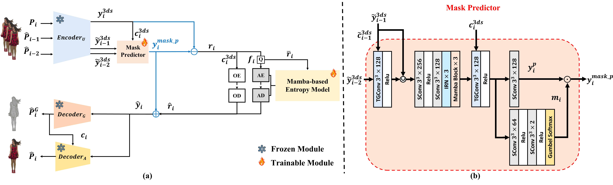
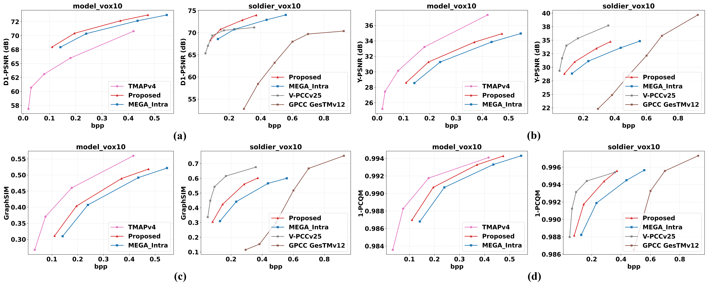

<h1 align="center">uniMaskRC-DPCC: unified Mask Residual Coding Framework for End-to-End Learned Dynamic Point Cloud Compression </h1>

    <strong><a href="https://github.com/kai0416s">Chi-Lin Wu</a></strong>,
    <strong><a href="mailto:yimmonyneath@gmail.com">Monyneath Yim</a></strong>, 
    <strong><a href="https://chiang.ccu.edu.tw/index.php">Jui-Chiu Chiang</a></strong>,

    National Chung Cheng University, Taiwan 

---

# Official Implementation for uniMaskRC-DPCC

* We propose uniMaskRC-DPCC, a dynamic extension of MEGA-PCC that enables end-to-end joint geometry–attribute compression under a unified encoder and dual decoders, avoiding separate pipelines and manual bitrate allocation.
* We introduce a learnable mask-guided residual coding mechanism that adaptively identifies predictionunreliable regions and selectively switches between residual coding and direct feature transmission, improving robustness in high-motion areas.
* Extensive experiments demonstrate that the proposed method significantly outperforms traditional standards (G-PCC) in both the geometry, attribute and perceptual performance.

# Abstract

Dynamic point cloud compression faces significant challenges due to the inherent unstructured and sparse nature of point clouds, requiring efficient exploitation of temporal redundancy and joint optimization of geometry and attributes. Existing methods for dynamic point clouds process geometry and attributes separately through cascaded pipelines, requiring post-hoc recoloring and manual bitrate allocation. Moreover, conventional predictive residual coding fails in high-motion regions, producing large residuals that are costly to encode. 

To address these limitations, we present uniMaskRC-DPCC, the first fully end-to-end unified framework for dynamic point cloud compression which enables joint optimization across temporal sequences, eliminating the need for recoloring and manual bitrate allocation. The key innovation is a learnable mask-guided residual coding mechanism that adaptively identifies prediction-unreliable regions and selectively switches between residual coding and direct feature transmission, preserving compression efficiency in temporally coherent areas while enhancing robustness in high-motion dynamic regions. 

Experimental results demonstrate that uniMaskRC-DPCC achieves superior performance with 86.8% D1 BD-Rate and 76.7% Y BD-Rate reductions compared to G-PCC, and 57.4% D1 BD-Rate reduction compared to TMAPv4, while maintaining competitive attribute and perceptual performance.

    (a) The overall architecture of the proposed uniMaskRC-DPCC (b) Mask Predictor module

# Result

We evaluate the rate–distortion performance of the proposed uniMaskRC-DPCC by comparing it with standardbased and learning-based codecs, including G-PCC, V-PCC, TMAPv4, and MEGA-PCC.

# Complexity Analysis

Complexity analysis for two sequences, including model size and runtime comparison. TMAPv4’s model size only for geometry compression.

